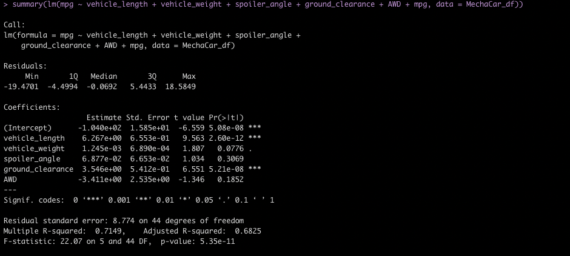
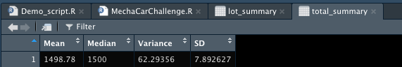
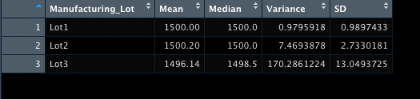
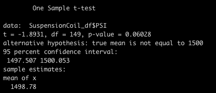
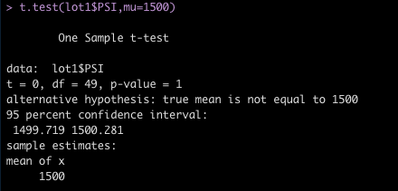
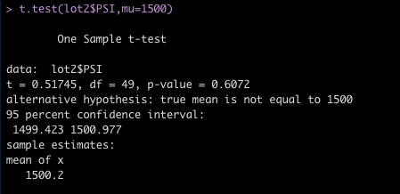
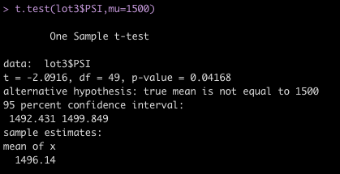

# MechaCar Statistical Analysis

## Overview
### Project Background
AutosRUs’ newest prototype, the MechaCar, is suffering from production troubles that are blocking the manufacturing team’s progress. AutosRUs’ upper management has called on the data analytics team to review the production data for insights that may help the manufacturing team.

### Analysis Requested:
- Perform multiple linear regression analysis to identify which variables in the dataset predict the mpg of MechaCar prototypes
- Collect summary statistics on the pounds per square inch (PSI) of the suspension coils from the manufacturing lots
- Run t-tests to determine if the manufacturing lots are statistically different from the mean population
- Design a statistical study to compare vehicle performance of the MechaCar vehicles against vehicles from other manufacturers. For each statistical analysis, you’ll write a summary interpretation of the findings.

## Results
### Linear Regression to Predict MPG

Based on the p-values compared to normal significance levels (0.05), the vehicle length and vehicle ground clearance have a statistic impact on the miles per gallon. However, the vehicle weight, spoiler angle,and AWD have p-Values that are considered random amount of variance.

The slope of this linear model is not zero, as the p value 5.35e-11 falls under the standard significance of 0.05.

Based on the r-squared value .7149, this model supports 71% of predictions and can be considered effective. 

### Summary Statistics on Suspension Coils

The design specifications for the MechaCar suspension coils dictate that the variance of the suspension coils must not exceed 100 pounds per square inch. 

While the overall Variance falls under this threshold as shown in the total summary (62), the specific lots to not all meet this criteria. Lot3 exceeds the variance, with 170. 

### T-Tests on Suspension Coils

  
  
  

### Study Design: MechaCar vs. Competition

Write a short description of a statistical study that can quantify how the MechaCar performs against the competition. In your study design, think critically about what metrics would be of interest to a consumer: for a few examples, cost, city or highway fuel efficiency, horse power, maintenance cost, or safety rating.
In your description, address the following questions:
- What metric or metrics are you going to test?
- What is the null hypothesis or alternative hypothesis?
- What statistical test would you use to test the hypothesis? And why?
- What data is needed to run the statistical test?

#### Resources
Data Source: [MechaCar_mpg.csv](Resources/MechaCar_mpg.csv), [Suspension_Coil.csv](Resources/Suspension_Coil.csv)
  Resources: RStudio, R, dplyr
